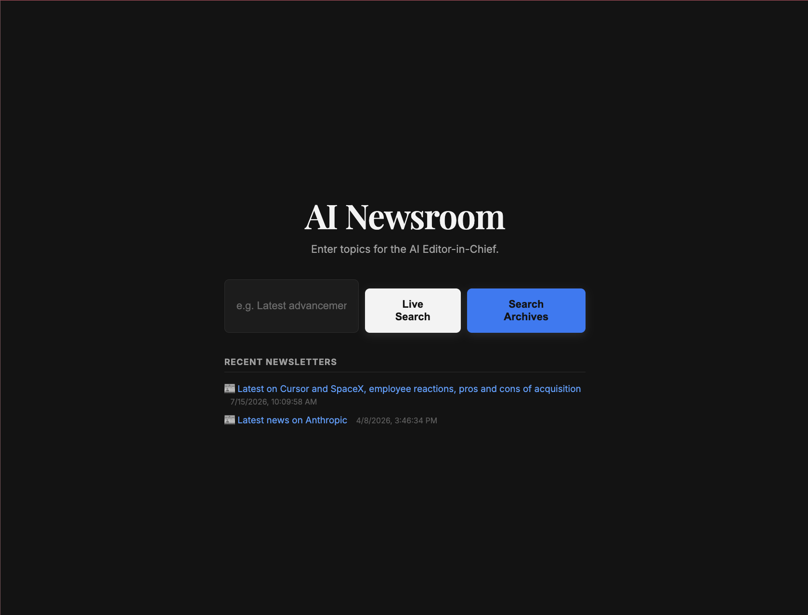
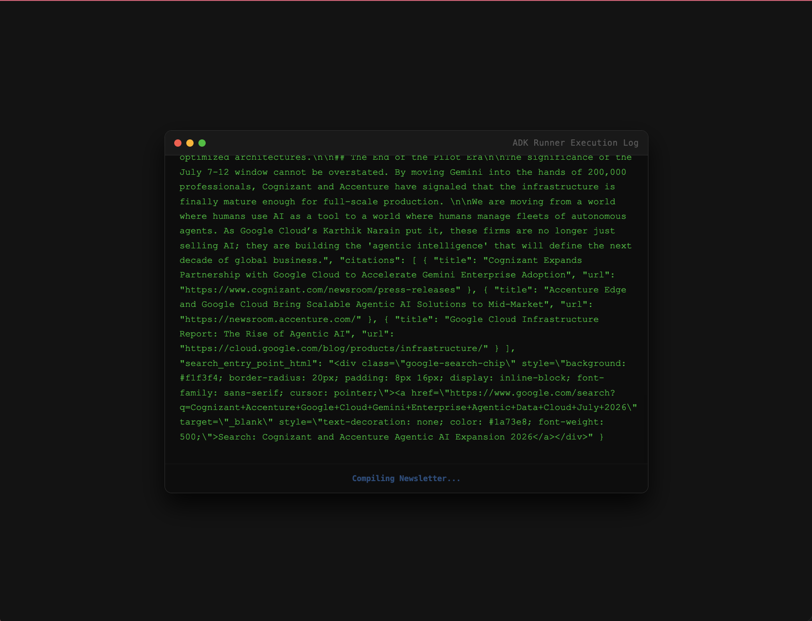
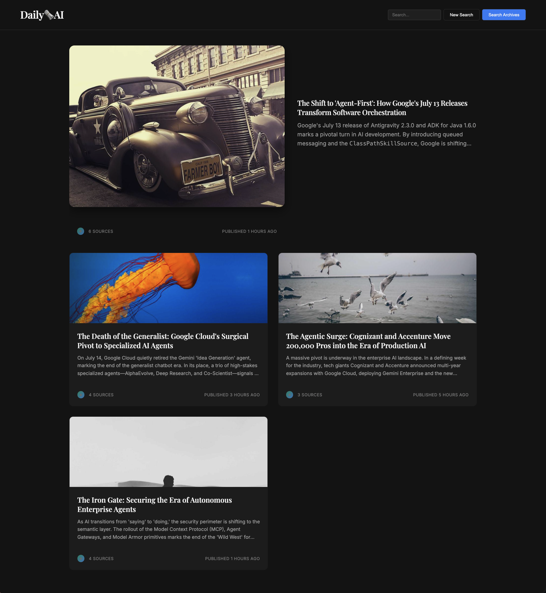

# Module 00: Welcome & Workshop Overview

Welcome to the **Agent Development Workshop**! This hands-on, code-first journey teaches you how to build, orchestrate, evaluate, and deploy production-grade AI agents using Google's **Agent Development Kit (ADK)**.

---

## Curriculum Overview

In this workshop, you will progress from a simple single-agent setup to a fully-featured, multi-agent AI Newsroom application running in production:

*   **Module 01: Foundation** — Build your first agent with custom Python tools.
*   **Module 02: Agent Orchestration** — Wire a Planner, Researcher, and Compiler together using the ADK 2.0 `Workflow` API.
*   **Module 03: Advanced Orchestration** — Introduce asyncio parallelism and Grounded Google Search.
*   **Module 04: Vector Search** — Integrate Vertex AI Vector Search to lookup archived articles alongside live research.
*   **Module 05: Agent Engine** — Deploy your agent code to Vertex AI Agent Engine as a managed service.
*   **Module 06: Evaluation** — Build an LLM-as-a-judge evaluation suite to systematically benchmark agent quality.
*   **Module 07: Production** — Wrap the app in a web service, containerize it, and deploy it to Cloud Run.

---

## Workshop overview

### 1. Welcome to the Workshop

Developing software with LLMs is transitioning from simple prompt engineering to engineering **autonomous systems**. When we build applications where the AI makes decisions, calls tools, and coordinates with other AI systems, we need reliable framework patterns, local debugging tools, and robust evaluation loops.

This workshop is designed to teach you those exact patterns. You will act as a developer building a sophisticated backend and pairing it with a web interface to deliver a polished user experience.

### 2. What are Agents?

An **AI Agent** is an autonomous entity powered by a Large Language Model (LLM) that can:
1.  **Reason and Plan:** Break down complex goals into discrete sub-tasks.
2.  **Use Tools:** Query external APIs, search databases, write code, or perform calculations.
3.  **Maintain State:** Keep track of conversation history, user preferences, and intermediate results.
4.  **Collaborate:** Transfer tasks or delegate sub-problems to other specialized agents.

Unlike traditional software that follows rigid conditional branches, agents leverage the reasoning capabilities of LLMs to dynamically decide the best path to accomplish a task.

### 3. What is the Agent Development Kit (ADK)?

The **Agent Development Kit (ADK)** is Google's open-source, code-first framework for building, testing, evaluating, and deploying autonomous agents. It provides a developer-friendly Python SDK and CLI that abstracts the complexities of state preservation, tool-calling loop execution, and multi-agent orchestration.

Key primitives in ADK 2.0 include:
*   **`Agent` (`LlmAgent`)**: The core intelligent actor defined by an instruction, a model, and a set of tools.
*   **`Tool`**: A regular Python function decorated or bound to an agent, giving it real-world capabilities.
*   **`Workflow`**: A graph-based execution pipeline of nodes and edges for deterministic multi-agent coordination.
*   **`Runner`**: The execution engine that runs agents and workflows, managing event emission and lifecycle callbacks.
*   **`Session` & `State`**: Stateful storage for maintaining conversational history and short-term agent memory.

### 4. What We'll Build: The AI Newsroom

Throughout this workshop, you will construct a fully-featured **AI Newsroom** application. It allows users to input a broad research topic, which then triggers a pipeline of specialized agents:

1.  **Planner Agent:** Parses the user request and plans specific web search queries.
2.  **Researcher Agents:** Conduct parallel web searches using Google Search Grounding to find reliable information.
3.  **Librarian Agent:** Searches an archive of local documents using Vertex AI Vector Search.
4.  **Editor-in-Chief Agent:** Merges the web research and archive results into a unified, formatted newspaper page.

This backend connects to a beautiful web application interface. Here is what the application looks like:

#### Newsroom Home
Students and users enter their search prompt, choose a research model, and customize settings.


#### Real-Time Researching
The UI streams the step-by-step thinking, search queries, and results from the agents in real-time.


#### Polished Newsletter Output
The final result is rendered in a clean grid layout featuring headlines, articles, and grounded citations.


---

## 🆘 Getting Stuck?

If you fall behind or need a clean start for any module, you can instantly catch up to the beginning of the module by running the following command in your terminal:

```bash
make catchup module=01
```
*(Replace `01` with the module number you wish to start).*

---

## References & Further Reading

*   **[ADK Docs (adk.dev)](https://adk.dev)**: The official website and documentation for the Google Agent Development Kit.
*   **[ADK Python GitHub](https://github.com/google/adk-python)**: The open-source repository for the ADK Python SDK.
*   **[Google GenAI SDK](https://github.com/googleapis/python-genai)**: The underlying client library used to interact with Gemini models.
