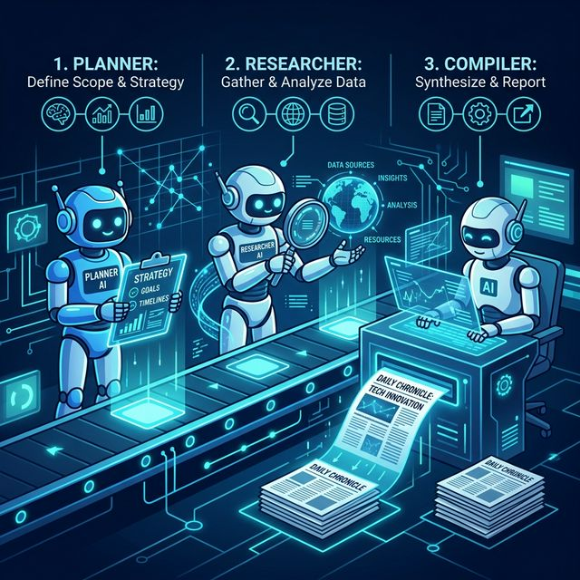
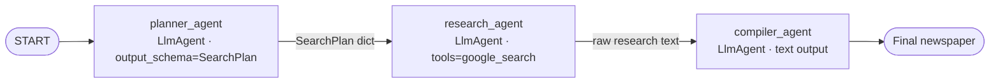

# Module 02: Agent Orchestration (The Newsroom)


In this module you'll move beyond a single agent and build a multi-agent **AI Newsroom** as a graph-based pipeline.

A **Planner** breaks down a broad user request into specific Google Search queries. A **Researcher** runs those queries with the built-in `google_search` tool. An **Editor-in-Chief** synthesizes the findings into a final newspaper. The whole thing is wired together with the new ADK 2.0 `Workflow` graph API.

> **Heads up — this is the ADK 2.0 Workflow API version of the workshop.** It targets the official **ADK 2.0** release (`google-adk>=2.0.0`). See the [ADK 2.0 overview](https://adk.dev/2.0/) for the full graph API.

## Architecture



The pipeline is a `Workflow` with three linear edges. Each node's return value becomes the next node's `node_input` — no `{state_var}` interpolation, no `output_key` plumbing for intermediate steps. See [adk.dev/workflows/data-handling](https://adk.dev/workflows/data-handling/) for the exact data-flow rules.

## Before You Begin

After running `make catchup module=02` your workspace contains the **mod01 solution** — a single `Agent` with `get_weather` and `get_current_server_time` tools. Mod02 replaces this design entirely with a multi-agent Workflow, so you can delete (or comment out) the existing `root_agent`, `app`, `get_weather`, and the `Agent` / `Gemini` / `types` imports as you build up the new pipeline. The `import datetime` line and `get_current_server_time()` helper are still used.

## Your Objectives

### 1. Centralize the model string

Pin the model string near the top of `workspace/app/agent.py`, just below the imports. Every agent in the pipeline uses the same fast model, `gemini-3.5-flash`. (Defining it once makes it trivial to swap later — and in production you might give a heavier-weight agent like the editor a stronger model.)

```python
model = "gemini-3.5-flash"
```

> [!NOTE]
> `import datetime` and the `get_current_server_time()` helper are **already in your starter file** (it's the Module 01 solution). Keep them — the planner uses the current date to focus on recent news. Don't paste them again.

### 2. Build the Planner with a structured output schema

Use `output_schema` with a Pydantic model. ADK forces the model to emit a JSON object matching the schema, and the next node receives it as a `dict` — no string parsing required.

```python
from pydantic import BaseModel, Field
from google.adk.agents import LlmAgent

class SearchPlan(BaseModel):
    queries: list[str] = Field(
        description="2-3 very specific Google Search queries to research."
    )

planner_agent = LlmAgent(
    name="planner_agent",
    model=model,
    instruction=f"""
    The current date and time is: {get_current_server_time()}

    You are a senior news editor. Given a broad news topic from the user,
    generate a structured plan of specific Google Search queries. Focus the
    queries on recent developments from the past 3 days unless the user
    requests otherwise.
    """,
    output_schema=SearchPlan,
)
```

### 3. Build the Researcher with `google_search`

ADK's built-in `google_search` tool grounds the researcher's output in real web results. Notice the instruction is now strictly a system prompt — no `{search_plan}` placeholder. The previous node's output (the `SearchPlan` dict) is auto-injected as the LLM's user message.

```python
from google.adk.tools import google_search

research_agent = LlmAgent(
    name="research_agent",
    model=model,
    instruction=f"""
    The current date and time is: {get_current_server_time()}

    You are a news researcher. The previous step has produced a SearchPlan
    with a list of queries. Execute a Google Search for each query and
    return a rough compilation of the facts you find.
    """,
    tools=[google_search],
)
```

### 4. Build the Compiler

Final agent in the chain. No `output_schema` — it just emits text (Module 03 introduces structured `NewspaperPage` output).

```python
compiler_agent = LlmAgent(
    name="compiler_agent",
    model=model,
    instruction=f"""
    The current date and time is: {get_current_server_time()}

    You are the news editor-in-chief. Read the raw research provided as input
    and synthesize it into a cohesive, engaging final newspaper.
    """,
)
```

### 5. Compose the Workflow

The `Workflow` IS the root agent — no conversational outer LlmAgent, no `sub_agents=[…]` delegation. Just three edges that map predecessor outputs to successor inputs.

> [!NOTE]
> Want a chat agent that *calls* this pipeline on demand instead of being replaced by it? A `Workflow` isn't an `Agent`, so `sub_agents=[workflow]` won't work — you expose it as a function tool. See the [Module 04 bonus: a conversational front door](../04-vector-search/README.md#bonus-a-conversational-front-door-calling-a-workflow-from-a-chat-agent).

```python
from google.adk.workflow import Workflow
from google.adk.apps import App

root_agent = Workflow(
    name="news_workflow",
    edges=[
        ("START", planner_agent),
        (planner_agent, research_agent),
        (research_agent, compiler_agent),
    ],
)

app = App(root_agent=root_agent, name="app")
```

📚 [adk.dev/workflows](https://adk.dev/workflows/) — full Workflow API reference.

## Try it

```bash
make adk-web       # ADK Web on :8500 — pick the `app` folder when prompted
```

ADK Web's run pane shows the planner's `SearchPlan`, the researcher's tool calls, and the compiler's final newspaper text. Exercise the pipeline with prompts like *"Latest news on AI agents from the past three days."*

## References & Further Reading

- **ADK 2.0 overview** — [adk.dev/2.0](https://adk.dev/2.0/) (install, the graph API mental model).
- **Workflow API** — [adk.dev/workflows](https://adk.dev/workflows/) (nodes, edges, START — the mental model).
- **Data flow between nodes** — [adk.dev/workflows/data-handling](https://adk.dev/workflows/data-handling/) (how `node_input` is populated; structured output passing).
- **Google Search Grounding** — [docs.cloud.google.com/vertex-ai/.../grounding-with-google-search](https://docs.cloud.google.com/vertex-ai/generative-ai/docs/grounding/grounding-with-google-search) (display requirements; relevant once you produce structured citations in Module 03).
- **Repo-internal cheatsheet** — [`.agents/skills/google-agents-cli-adk-code/references/adk-2.0.md`](../../.agents/skills/google-agents-cli-adk-code/references/adk-2.0.md) (mostly accurate; see [GEMINI.md](../../GEMINI.md) → "ADK 2.0 Cheatsheet Overrides" for known errata).

## 🆘 Getting Stuck?

If you fall behind or your code isn't working, you can instantly catch up to the beginning of the **next module** by running:

```bash
make catchup module=03
```

*(Note: this completely overwrites your current `workspace/` with the known-good baseline for the next module.)*

To re-load the canonical Module 02 solution into your workspace:

```bash
make solve module=02
```
