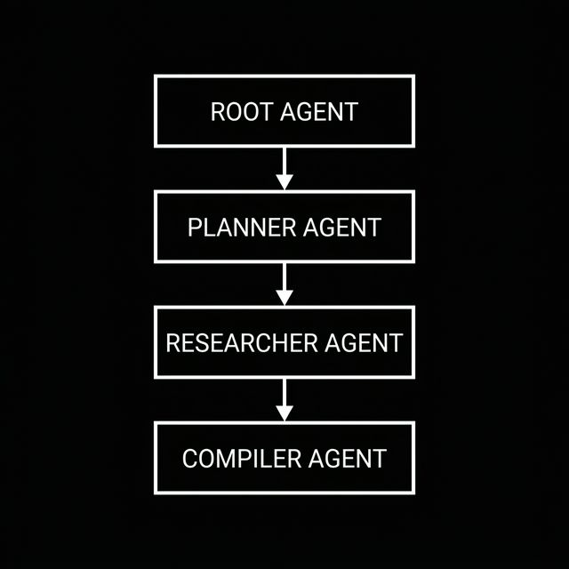
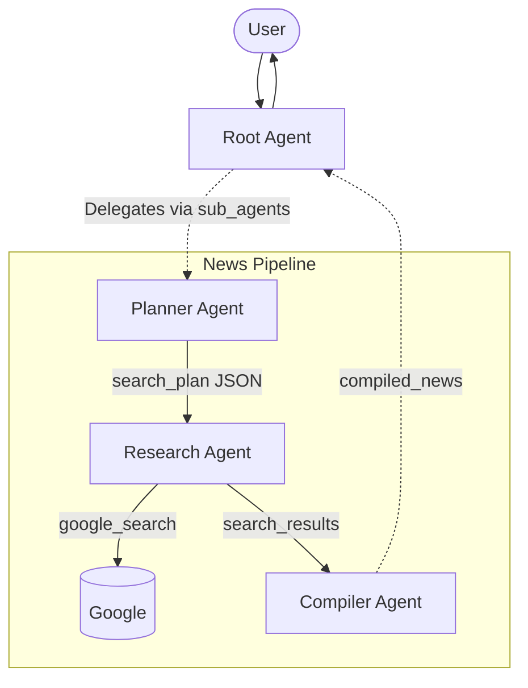

# Module 02: Agent Orchestration (The Newsroom)

In this module, we move beyond a single agent and build a powerful multi-agent orchestration pattern using native ADK workflows. 

You will build an AI "Newsroom". Rather than having one agent vaguely handle everything, you will create a pipeline: a **Planner** breaks down a broad user request into specific topics, a **Researcher** gathers information on those topics using real Google Search, and an **Editor** aggregates their findings into a final newscast. Finally, you will equip this entire pipeline to your main conversational agent using native LLM Delegation!

### The Architecture 





---

## Your Objectives

### 1. Preparation: Models and Time
First, centralize your model strings at the top of `app/agent.py` to keep things clean. You will also create a helper function so agents know the current date (critical for fetching recent news).

<details>
<summary>💡 Hint: Add these at the top of your file</summary>

```python
import datetime

worker_model = "gemini-3-flash-preview"
pro_model = "gemini-3.1-pro-preview"

def get_current_server_time() -> str:
    now = datetime.datetime.now().astimezone()
    return f"The current server time is {now.strftime('%Y-%m-%d %H:%M:%S %Z (UTC%z)')}"
```
</details>

### 2. Build the Editor-in-Chief (Planner Agent)
Define an agent whose sole instruction is to take a broad user query and return a highly structured output list. To ensure the output is perfectly parseable, you will use ADK's `output_schema` parameter with a **Pydantic Model** and save the output to state using `output_key="search_plan"`.

<details>
<summary>💡 Hint: Pydantic Schema</summary>

```python
from pydantic import BaseModel, Field

class SearchPlan(BaseModel):
    queries: list[str] = Field(
        description="A list of 2 to 3 very specific Google Search queries to research."
    )
```
</details>

<details>
<summary>💡 Hint: Planner Prompt</summary>

```python
planner_agent = Agent(
    name="planner_agent",
    model=worker_model,
    instruction=f"""
    The current date and time is: {get_current_server_time()}

    You are a senior news editor. 
    Given a broad news topic from the user, generate a structured plan of specific Google Search queries.
    Ensure you instruct the searches to strictly focus on recent developments from the past 3 days.
    """,
    output_schema=SearchPlan,
    output_key="search_plan",
)
```
</details>

### 3. Build the Researcher 
Create a second agent equipped with the `google_search` tool built into the ADK (`from google.adk.tools import google_search`). Tell it to read the `search_plan` generated by the previous agent!

<details>
<summary>💡 Hint: Researcher Prompt</summary>

```python
research_agent = Agent(
    name="research_agent",
    model=worker_model,
    instruction=f"""
    The current date and time is: {get_current_server_time()}

    You are a news researcher. 
    Look at the `{{search_plan}}` provided in the state. 
    Execute Google Searches for each query listed. Return a rough compilation of all the facts you find.
    """,
    tools=[google_search],
    output_key="search_results",
)
```
*(Note: We use double braces `{{search_plan}}` so Python's f-string doesn't crash trying to evaluate ADK's dynamic state injection!)*
</details>

### 4. Build the Compiler 
Create the final agent in the chain. Give it the `pro_model` for maximum writing quality, and instruct it to read the `{search_results}` to synthesize the final broadcast.

<details>
<summary>💡 Hint: Compiler Prompt</summary>

```python
compiler_agent = Agent(
    name="compiler_agent",
    model=pro_model,
    instruction=f"""
    The current date and time is: {get_current_server_time()}

    You are the news editor-in-chief. 
    Read the raw research provided in `{{search_results}}` via the state. 
    Synthesize it into a cohesive, engaging final newspaper.
    """,
    output_key="compiled_news",
)
```
</details>

### 5. Wire the Pipeline and Delegate!
Wrap your three agents in a `SequentialAgent`. Finally, rather than mounting it as an `AgentTool`, mount the pipeline to your `root_agent` using LLM Delegation (`sub_agents`). This allows the LLM to decide natively when to trigger the research flow!

<details>
<summary>💡 Hint: Pipeline and Root Agent</summary>

```python
news_pipeline = SequentialAgent(
    name="news_pipeline",
    description="A specialized research pipeline that plans queries, executes searches, and compiles a comprehensive newspaper. Use this whenever the user asks for news.",
    sub_agents=[planner_agent, research_agent, compiler_agent],
)

root_agent = Agent(
    name="root_agent",
    model=worker_model,
    instruction="""
    You are a helpful, conversational AI. Delegate to `news_pipeline` sub-agent 
    whenever a user asks you to look up news; otherwise, answer the user's query directly.
    """,
    sub_agents=[news_pipeline],
)
```
</details>

---

## 🆘 Getting Stuck?

If you fall behind or your code isn't working, you can instantly catch up to the beginning of the **next module** by running:

```bash
make catchup module=03
```
*(Note: This will completely overwrite your current `workspace/` with the known good baseline for the next module!)*
