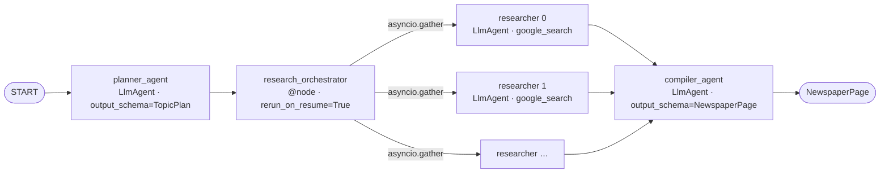

# Module 03: Advanced Orchestration (Parallelism & Grounding)

In Module 02 we built a linear three-step pipeline. In this module we'll evolve it into a **parallel research workflow**: a single Planner generates N topics, the framework spawns N independent researchers concurrently via the new ADK 2.0 dynamic-workflow API, and a Compiler aggregates their structured drafts into a final `NewspaperPage`.

Along the way you'll learn the most important pattern in production agentic AI: **defeating URL hallucination by grounding citations in real Vertex AI Search metadata.**

> **Heads up — this is the ADK 2.0 Workflow API version of the workshop.** It targets the official **ADK 2.0** release (`google-adk>=2.0.0`). See the [ADK 2.0 overview](https://adk.dev/2.0/) for the full graph API.

## Architecture



The orchestrator is a Python `@node` that fans out to N researchers using `asyncio.gather(*[ctx.run_node(researcher_agent, node_input=topic) for topic in topics])`. The number of branches is determined at runtime by the Planner's `TopicPlan.topics` list — you couldn't express this with the old `ParallelAgent` (which required a static list of sub-agents at construction time). See [adk.dev/workflows/dynamic](https://adk.dev/workflows/dynamic/) for the canonical pattern.

## The Big Lesson: defeating URL hallucination

One of the single biggest challenges in agentic AI is **URL hallucination**. If you tell an LLM to populate a `Citation.url` field, it will frequently fabricate plausible-looking URLs that lead to 404s. We don't trust the LLM with this.

Instead, ADK transparently surfaces Google Search's grounding metadata on each LLM response event. The deterministic citation URLs and the required Search Suggestion chip HTML both live there. The orchestrator captures them by slicing `session.events` around each `ctx.run_node` call and attaches them to the article dict before passing the drafts to the compiler. The compiler is then instructed to preserve the values verbatim.

The helper that walks the event slice lives in [`utils/citations.py`](../../utils/citations.py) — kept out of the agent file so the pipeline structure stays readable.

> ⚠️ **Parallel attribution caveat (intentional teaching surface)**: every parallel `ctx.run_node` call shares one `session.events` stream, and Python `asyncio` runs each coroutine up to its first `await` synchronously, so all `research_one` tasks capture the same `start` index. As tasks complete, each captures `end` at its own moment but the slice `[start:end]` picks up grounding chunks emitted by *peers* that happened to finish earlier. The resulting per-article citation list is a *superset* of that researcher's real grounding chunks. Real-world async agent systems trade attribution precision for throughput; this is a clean, observable example. See `utils/citations.py` for the long-form discussion plus the cleaner ("verified URL pool") alternative.

## Your Objectives

### 1. Define your Pydantic schemas

These drive ADK's structured-output enforcement and downstream `node_input` typing.

```python
from pydantic import BaseModel, Field
from typing import Optional

class Citation(BaseModel):
    title: str = Field(description="Title of the source")
    url: str = Field(description="URL of the source")

class ArticleDraft(BaseModel):
    title: str = Field(description="Catchy headline")
    teaser: str = Field(description="Short engaging teaser in markdown format")
    content: str = Field(description="Full article content in markdown format")

class Article(ArticleDraft):
    citations: list[Citation] = Field(default_factory=list)
    search_entry_point_html: Optional[str] = Field(default=None)

class NewspaperPage(BaseModel):
    articles: list[Article]

class TopicPlan(BaseModel):
    topics: list[str]
```

### 2. Build the Planner

Replaces Module 02's `SearchPlan` with a `TopicPlan`. The orchestrator below receives the dict directly as `node_input` — no JSON-string parsing required (this is the regex hack the 1.x version needed).

```python
from google.adk.agents import LlmAgent
from google.adk.tools import google_search

planner_agent = LlmAgent(
    name="planner_agent",
    model=model,
    instruction=f"""
    The current date and time is: {get_current_server_time()}

    You are a senior news editor. Given a broad news request from the user,
    generate a structured plan of at least 3 specific topics or "beats" to
    assign to your research team. Focus on recent developments from the past
    3 days unless the user requests otherwise. Use Google Search to discover
    the most important beats first.
    """,
    tools=[google_search],
    output_schema=TopicPlan,
)
```

### 3. Build a single shared Researcher template

One `LlmAgent` definition. The orchestrator below spawns N parallel sub-runs of this same instance — one per topic — via `ctx.run_node`. Each sub-run gets its own LLM context but writes events into the parent workflow's `session.events` stream.

```python
researcher_agent = LlmAgent(
    name="researcher",
    model=model,
    instruction=f"""
    The current date and time is: {get_current_server_time()}

    You are an expert investigative journalist. Research the following beat
    thoroughly. Draft a high-quality, engaging article with a catchy headline,
    a short engaging teaser, and the full content body. Output in Markdown
    format. Use Google Search to gather factual information.
    """,
    tools=[google_search],
    output_schema=Article,
)
```

### 4. Build the dynamic-parallel Research Orchestrator

This is the big upgrade from Module 02. The 1.x version needed a custom `BaseAgent` subclass (`ParallelResearcherFactory`), regex JSON parsing, and per-researcher `after_agent_callback` for citation extraction. The new pattern collapses all of that into one function:

```python
import asyncio
from google.adk.agents.context import Context
from google.adk.workflow import node
from utils.citations import extract_citations_from_events

@node(rerun_on_resume=True)
async def research_orchestrator(ctx: Context, node_input: dict) -> list:
    topics = node_input.get("topics", []) if isinstance(node_input, dict) else []

    async def research_one(topic: str, idx: int) -> dict:
        start = len(ctx.session.events)
        article = await ctx.run_node(researcher_agent, node_input=topic)
        end = len(ctx.session.events)
        citations, rendered = extract_citations_from_events(
            ctx.session.events[start:end]
        )
        if isinstance(article, dict):
            article["citations"] = citations
            if rendered:
                article["search_entry_point_html"] = rendered
        return article

    tasks = [research_one(t, i) for i, t in enumerate(topics)]
    return await asyncio.gather(*tasks)
```

Three details worth memorizing:

1. **`rerun_on_resume=True` is required** on any node that calls `ctx.run_node`. Workflow's resume semantics need it to relaunch interrupted children.
2. **`ctx.run_node()` returns a coroutine** (not a result) — so we wrap it in another async function and use `asyncio.gather` over a list comprehension.
3. **Citation extraction sits in the orchestrator**, not on a per-researcher callback. The 1.x callback approach doesn't translate cleanly to ADK 2.0's event model — see `utils/citations.py` for why.

📚 [adk.dev/workflows/dynamic](https://adk.dev/workflows/dynamic/) — canonical dynamic-parallelism reference.

### 5. Build the Compiler with persistence

The compiler aggregates drafts into a final `NewspaperPage`. **The `output_key="compiled_news"` is load-bearing** — without it, `webapp/app.py`'s persistence guard (`session.state.get("compiled_news")`) returns empty and no newsletter file is written, so the front-end never transitions from the diagnostic event log to the rendered article grid.

```python
compiler_agent = LlmAgent(
    name="compiler_agent",
    model=model,
    instruction=f"""
    The current date and time is: {get_current_server_time()}

    You are the news editor-in-chief. The previous step provided drafted
    articles from your reporters, each with their true citations.

    Read the drafts. Choose the best ones, drop or merge duplicates, evaluate
    them for quality, and compile them into a cohesive final NewspaperPage.

    CRITICAL: You must strictly preserve each article's exact `citations`
    array and `search_entry_point_html` value. If an article's `citations`
    array is empty `[]`, output an empty array. DO NOT invent, hallucinate,
    edit, or modify any URLs or HTML. The search_entry_point_html is
    required by Google's grounding terms — dropping it breaks compliance.
    """,
    output_schema=NewspaperPage,
    output_key="compiled_news",
)
```

### 6. Compose the Workflow

```python
from google.adk.workflow import Workflow
from google.adk.apps import App

root_agent = Workflow(
    name="news_workflow",
    edges=[
        ("START", planner_agent),
        (planner_agent, research_orchestrator),
        (research_orchestrator, compiler_agent),
    ],
)

app = App(root_agent=root_agent, name="app")
```

## Google Search Grounding compliance

Module 03 is the first module that produces structured output the webapp can render — which means it's also the first that has to honor the [Google Search Grounding display requirements](https://docs.cloud.google.com/vertex-ai/generative-ai/docs/grounding/grounding-with-google-search).

The required Search Suggestion chip's HTML lives at `groundingMetadata.searchEntryPoint.renderedContent`. `extract_citations_from_events` pulls it out, the orchestrator attaches it as each article's `search_entry_point_html`, the compiler is instructed to preserve it verbatim, and the webapp renders it via `innerHTML` in the article modal so the chip's own `@media(prefers-color-scheme)` styles survive intact.

If you ever change the rendering path (e.g. switch the webapp from `innerHTML` to a sanitizer that strips inline styles), confirm the chip still displays in both light and dark modes before shipping.

## Try it

```bash
make adk-web       # ADK Web on :8500 — pick the `app` folder when prompted
```

ADK Web's event view is the right tool for inspecting parallel pipelines like this one — you can watch the planner's TopicPlan land, then see N concurrent researcher invocations stream in interleaved, then the compiler's final NewspaperPage. (The custom AI Newsroom web app — `make run-webapp` — comes in mod04, which embeds an ADK `Runner` into a Flask front-end as a teaching example.)

You can also drive the agent from the CLI:

```bash
uv run adk run workspace/app
```

## References & Further Reading

- **ADK 2.0 overview** — [adk.dev/2.0](https://adk.dev/2.0/) (install; the graph API mental model).
- **Workflow API** — [adk.dev/workflows](https://adk.dev/workflows/) (nodes, edges, START — the mental model).
- **Dynamic parallelism** — [adk.dev/workflows/dynamic](https://adk.dev/workflows/dynamic/) (`ctx.run_node` + `asyncio.gather` patterns).
- **Data flow between nodes** — [adk.dev/workflows/data-handling](https://adk.dev/workflows/data-handling/) (how `node_input` is populated; structured output passing).
- **Google Search Grounding display requirements** — [docs.cloud.google.com/vertex-ai/.../grounding-with-google-search](https://docs.cloud.google.com/vertex-ai/generative-ai/docs/grounding/grounding-with-google-search).
- **Repo-internal cheatsheet** — [`.agents/skills/google-agents-cli-adk-code/references/adk-2.0.md`](../../.agents/skills/google-agents-cli-adk-code/references/adk-2.0.md) (mostly accurate; see [GEMINI.md](../../GEMINI.md) → "ADK 2.0 Cheatsheet Overrides" for known errata).

## 🆘 Getting Stuck?

If you fall behind or your code isn't working, you can instantly catch up to the beginning of the **next module** by running:

```bash
make catchup module=04
```

*(Note: this completely overwrites your current `workspace/` with the known-good baseline for the next module.)*

To re-load the canonical Module 03 solution into your workspace:

```bash
make solve module=03
```
