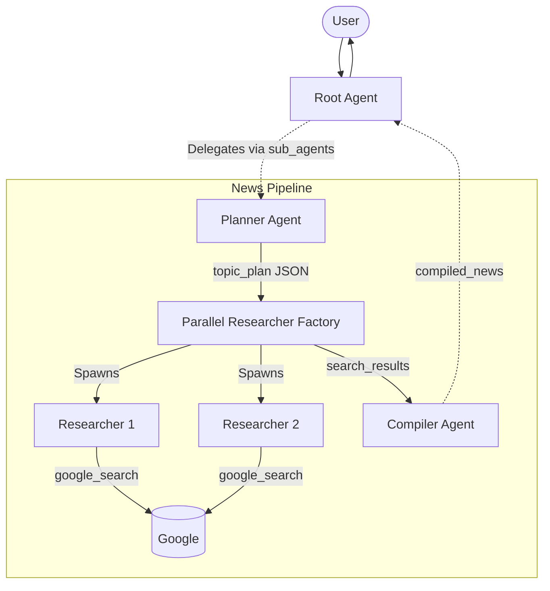

# Module 03: Advanced Orchestration (Parallelism & Grounding)

In Module 02, we introduced basic agent routing. Now, we are going to build a highly advanced, parallel multi-agent pipeline. 

You will build an AI "Newsroom". A **Planner Agent** will break down a broad topic into specific sub-queries. A **Parallel Research Factory** will dynamically spin up independent researchers to execute those queries simultaneously. Finally, a **Compiler Agent** will aggregate their citations and write a newscast. 

To run this pipeline outside of a conversational web UI, we will also build a native programmatic Python test harness.

### The Architecture 




---

## Provided Scaffolding
Because ADK's parallel orchestration and event introspection can get practically microscopic, please copy and paste the following heavily engineered pieces directly into your `app/agent.py` file. We will use them to build the actual Agents in the next phase!

<details>
<summary>1. Pydantic Models</summary>

```python
from pydantic import BaseModel, Field

class Citation(BaseModel):
    title: str = Field(description="Title of the source")
    url: str = Field(description="URL of the source")

class ArticleDraft(BaseModel):
    title: str = Field(description="Catchy headline")
    teaser: str = Field(description="Short engaging teaser in markdown format")
    content: str = Field(description="Full article content in markdown format")

class Article(ArticleDraft):
    citations: list[Citation] = Field(description="Sources used in this article")

class NewspaperPage(BaseModel):
    articles: list[Article] = Field(
        description="Collection of articles for the front page"
    )
```
</details>

<details>
<summary>2. Grounding Citation Callback</summary>

*ADK transparently surfaces internal LLM data types via the Event stream. We use this closure to harvest algorithmic citations straight from Vertex AI!*

```python
from google.adk.agents.callback_context import CallbackContext

def make_citations_callback(agent_name: str, output_key: str):
    async def extract_citations_callback(callback_context: CallbackContext) -> None:
        """
        Extracts citations from the LLM's grounding metadata.
        """
        session = callback_context._invocation_context.session
        citations = []
        seen_urls = set()

        for event in reversed(session.events):
            if (
                event.author == agent_name
                and getattr(event, "grounding_metadata", None)
                and getattr(event.grounding_metadata, "grounding_chunks", None)
            ):
                for chunk in event.grounding_metadata.grounding_chunks:
                    if getattr(chunk, "web", None) and chunk.web.uri not in seen_urls:
                        seen_urls.add(chunk.web.uri)
                        citations.append({"title": getattr(chunk.web, "title", "No Title"), "url": chunk.web.uri})
                break  

        if output_key and output_key in callback_context.state:
            state_val = callback_context.state[output_key]
            # Override hallucinated LLM citations with authentic Vertex URLs
            if hasattr(state_val, "citations"):
                state_val.citations = [Citation(**c) for c in citations]
            elif isinstance(state_val, dict):
                state_val["citations"] = citations
            elif isinstance(state_val, str):
                # Workaround for the Gemini SDK 400 Error when using tools + schemas:
                # If the state_val is a str (raw markdown instead of Pydantic object),
                # Store citations explicitly as a JSON-serializable dict in a parallel state key.
                citations_key = f"{output_key}_citations"
                callback_context.state[citations_key] = [Citation(**c).model_dump() for c in citations]

    return extract_citations_callback

async def prepare_drafts_callback(callback_context: CallbackContext) -> None:
    articles_data = []
    for i in range(100):
        key = f"article_{i}"
        val = callback_context.state.get(key)
        
        if val is not None:
            # Retrieve the parallel strongly-typed citation dicts
            citations_dict = callback_context.state.get(f"{key}_citations", [])
            
            articles_data.append({
                "content": val,
                "citations": citations_dict
            })
    import json

    serialized = []
    for art in articles_data:
        # art is now a dictionary containing "content" (str) and "citations" (List[dict])
        serialized.append(art)
        
    callback_context.state["draft_articles"] = json.dumps(serialized, indent=2)
```
</details>

<details>
<summary>3. Parallel Researcher Factory</summary>

```python
from typing import AsyncGenerator
from google.adk.agents.invocation_context import InvocationContext
from google.adk.events import Event
from google.adk.agents import BaseAgent, ParallelAgent, Agent
from google.adk.tools import google_search
# Note: make sure this returns the global `get_current_server_time()` implemented earlier!

def create_research_agent(topic: str, index: int) -> Agent:
    agent_name = f"researcher_{index}"
    out_key = f"article_{index}"
    return Agent(
        name=agent_name,
        model=worker_model,
        instruction=f"""
        The current date and time is: {{get_current_server_time()}}
        
        You are an expert investigative journalist. Research the following beat thoroughly: {topic}.
        Draft a high-quality, engaging article about your findings. Ensure your article has a catchy headline, a short engaging teaser, and the full content body.
        Your final output must be in Markdown format. Use Google Search to gather factual information.
        """,
        tools=[google_search],
        output_key=out_key,
        after_agent_callback=make_citations_callback(agent_name, out_key),
    )

class ParallelResearcherFactory(BaseAgent):
    async def _run_async_impl(
        self, event: Event, callback_context: CallbackContext, invocation_context: InvocationContext
    ) -> AsyncGenerator[Event, None]:
        
        # We need to manually parse the raw output string from the planner_agent
        topic_plan_raw = ""
        topic_plan_state = callback_context.state.get("topic_plan")
        if topic_plan_state:
            if isinstance(topic_plan_state, str):
                topic_plan_raw = topic_plan_state
            elif isinstance(topic_plan_state, dict):
                topic_plan_raw = topic_plan_state.get("topics", "[]")

        import json
        try:
            topics = json.loads(topic_plan_raw)
            if not isinstance(topics, list):
                topics = []
        except json.JSONDecodeError:
            topics = []

        if not topics:
            return

        researchers = [
            create_research_agent(topic, i) for i, topic in enumerate(topics)
        ]

        parallel_runner = ParallelAgent(
            name="parallel_research_executor", sub_agents=researchers
        )

        async for child_event in parallel_runner.run_async(invocation_context):
            yield child_event

research_team = ParallelResearcherFactory(name="research_team")
```
</details>

<details>
<summary>4. Local Terminal Runner</summary>

*Add this to the absolute bottom of `app/agent.py` to allow execution via scripts rather than just the Web UI.*

```python
import asyncio
from google.adk.runners import Runner
from google.adk.sessions import InMemorySessionService
from google.genai import types

async def main():
    session_id = "test_pipeline"
    user_id = "test_user"
    app_name = "test_app"
    query = "What's the latest news on AI Agents from OpenAI, Google, and Anthropic?"

    session_service = InMemorySessionService()
    
    # Note: Ensure `root_agent` is fully defined above before invoking the Runner!
    runner = Runner(
        app_name=app_name, agent=root_agent, session_service=session_service
    )

    try:
        await session_service.create_session(
            app_name=app_name, user_id=user_id, session_id=session_id
        )

        user_message = types.Content(role="user", parts=[types.Part(text=query)])
        print(f"Running query: {query}")
        print("Executing ADK pipeline... (this may take up to 60 seconds)")

        async for event in runner.run_async(
            user_id=user_id, session_id=session_id, new_message=user_message
        ):
            if (
                hasattr(event, "content")
                and event.content
                and isinstance(event.content, types.Content)
            ):
                for part in event.content.parts:
                    if part.text:
                        print(f"[{event.author}]: {part.text}")

        current_session = await session_service.get_session(session_id)

        compiled = current_session.state.get("compiled_news", {})
        import json
        print("-" * 80)
        print("FINAL COMPILED NEWSPAPER:")
        print(json.dumps(compiled, indent=2))

    except Exception as e:
        import traceback
        traceback.print_exc()

if __name__ == "__main__":
    asyncio.run(main())
```
</details>

---

## The Big Lesson: Defeating URL Hallucination with Callbacks

One of the single biggest challenges in Agentic AI is **URL Hallucination**. If you ask an LLM to populate a `Citation` schema with a `url` field, it will frequently generate "ghost links" (URLs that look perfectly logical but lead to 404 errors).

How do we solve this in Module 03? **We don't trust the LLM.**

Instead of relying on the model to accurately format a URL string, we leverage the ADK's native integration with **Vertex AI Grounding**.

1. When the `google_search` tool is invoked, Vertex AI appends the *true, deterministic URLs* to the raw LLM response as `grounding_metadata`.
2. ADK automatically maps this metadata into its `Event` stream.
3. We attach an **`after_agent_callback`** (`make_citations_callback`) to the Researcher agents.
4. As soon as a Researcher finishes drafting an article, the callback intercepts the pipeline, reads the event stream, finds the authentic URLs, and **forcefully overwrites** the LLM's hallucinated citation array in the `session.state`.

This is the power of the ADK Callback system: it allows you to blend the creative reasoning of an LLM with the deterministic data safety of traditional software engineering.

---

## Your Objectives

### 1. Build the Editor-in-Chief (Planner Agent)
Now that you have the supporting pieces, define `planner_agent` to take a broad user query and output a plan! To bypass an API error where Gemini refuses to run tool functions against strict output formats, we must write prompts that enforce format structure manually.
Guarantee it outputs a **pure JSON array** of strings (e.g. `["Topic 1", "Topic 2"]`) and assign it to `output_key="topic_plan"`.

### 2. Build the Compiler 
Create the `compiler_agent`. Make sure it reads the results produced by the `research_team` via `{draft_articles}` and outputs to the `NewspaperPage` schema using `output_key="compiled_news"`. 
You MUST attach the `before_agent_callback=prepare_drafts_callback` to ensure it formats the JSON string smoothly before reading!

**Crucial Prompting Tip:** In your instructions, explicitly tell the Compiler to *preserve* the citations array exactly as it appears in the data. Warn it that if an article's citation array is empty `[]`, it must output an empty array and **never** hallucinate or invent URLs! 

### 3. Wire the Pipeline and Delegate!
Wrap your three agents (`planner_agent`, `research_team`, `compiler_agent`) in a `SequentialAgent` named `news_pipeline`. 

Finally, mount the `news_pipeline` to your `root_agent` using LLM Delegation (`sub_agents`). 

### 4. Run the Test Harness!
Once everything is wired, exit the web playground and trigger the local terminal test harness directly:
```bash
uv run python app/agent.py
```
Watch the internal ADK tool invocations fire in parallel!

---

## 🆘 Getting Stuck?

If you fall behind or your code isn't working, you can instantly catch up to the beginning of the **next module** by running:

```bash
make catchup module=04
```
*(Note: This will completely overwrite your current `workspace/` with the known good baseline for the next module!)*

## References & Further Reading
*   **[Parallel Agents Documentation](https://google.github.io/adk-docs/agents/workflow-agents/parallel-agents/)**: Core concepts for configuring a `ParallelAgent` workflow, firing off sub-agents concurrently to execute isolated work.
*   **[Callbacks: Observe, Customize, and Control](https://google.github.io/adk-docs/callbacks/)**: Extremely detailed explanation of ADK lifecycle hooks (`before_agent_callback` and `after_agent_callback`) for intercepting and altering the LLM Event stream.
*   **[Vertex AI Search Grounding Guide](https://google.github.io/adk-docs/grounding/vertex-ai-search-grounding/)**: Details how to connect agents to Vertex AI for grounding, and specifically how to extract authentic web citations from `grounding_metadata`.
*   **[Academic Research Sample](https://github.com/google/adk-samples/tree/main/python/agents/academic-research)**: Code reference for utilizing parallel researchers and compiling factual content.
