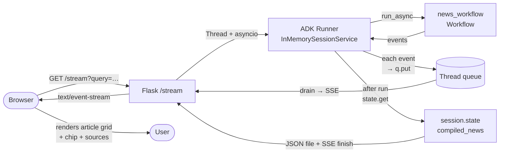

# Module 04: Vector Search & Structured UI Integration

In this module you will turn the Module 03 newsroom into a multi-purpose newsroom that **both** researches fresh news AND looks up archived stories from a Vertex AI Vector Search collection. You will:

- Add a router that picks between the live-news pipeline and the archive lookup.
- Build a Vector Search–backed tool and wire it into a librarian agent.
- Force structured output so the archive UI renders correctly.
- Honor Google Search Grounding's display requirements end-to-end.

> **Heads up — this is the ADK 2.0 Workflow API version of the workshop.** ADK 2.0 is in **Beta**. APIs may shift before GA — see the [ADK 2.0 overview](https://adk.dev/2.0/) for stability caveats.

## Architecture

```
                                     +-> planner_agent --> research_orchestrator
                                     |     (LlmAgent)        (@node, fan-out)        --> compiler_agent  ─► NewspaperPage
                                     |                                                       (terminal: news)
                            (route="news")
                                     |
       START --> router(@node) ─────-+
                                     |
                            (route="archive")
                                     |
                                     +-> archive_reader_agent ──────────────────────► NewspaperPage
                                              (terminal: archive)
```

Whichever branch the router picks runs to completion; that branch's terminal node output becomes the workflow output. There is no shared "compile both" step — the news path and the archive path are fully independent.

## Your Objectives

### 1. Build the router node

A function `@node` is the simplest way to express "look at the user's prompt, decide where this should go." It receives the START event's `node_input` (a `types.Content` payload — see the [data handling guide](https://adk.dev/workflows/data-handling/)) and emits an `Event` whose `route` value tells the workflow which downstream edge to follow.

```python
from google.adk.events.event import Event
from google.adk.workflow import node

ARCHIVE_KEYWORDS = ("archive", "past", "historical", "previously", "earlier",
                    "old", "from yesterday", "last week")

def _user_text(node_input) -> str:
    parts = getattr(node_input, "parts", None)
    if parts:
        return " ".join(p.text for p in parts if getattr(p, "text", None))
    return str(node_input)

@node
def router(node_input):
    text = _user_text(node_input).lower()
    if any(k in text for k in ARCHIVE_KEYWORDS):
        return Event(output=node_input, route="archive")
    return Event(output=node_input, route="news")
```

The webapp's "Search Archives" button prepends `Search the archive for past news on:` to the query, so a literal keyword match suffices for the workshop. **For an LLM-driven router**, swap this `@node` for an `LlmAgent(output_schema=RouteDecision)` and follow it with a small `@node` that converts the LLM's dict into `Event(route=...)`. The edges below stay the same.

📚 Routing API reference: [adk.dev/workflows/graph-routes](https://adk.dev/workflows/graph-routes/).

### 2. Migrate the news pipeline to dynamic parallel research

Module 03 used a custom `BaseAgent` (`ParallelResearcherFactory`) plus regex JSON parsing to fan out to N research agents. In 2.0 that whole pattern collapses into a single function `@node` that returns `await asyncio.gather(*tasks)`:

```python
from google.adk.agents import LlmAgent
from google.adk.agents.context import Context
from google.adk.workflow import node

researcher_agent = LlmAgent(
    name="researcher",
    model=worker_model,
    instruction="...You are an investigative journalist...",
    tools=[google_search],
    output_schema=Article,
)

@node(rerun_on_resume=True)
async def research_orchestrator(ctx: Context, node_input: dict) -> list:
    topics = node_input.get("topics", [])

    async def research_one(topic: str, idx: int) -> dict:
        start = len(ctx.session.events)
        article = await ctx.run_node(researcher_agent, node_input=topic)
        end = len(ctx.session.events)
        citations, rendered = extract_citations_from_events(
            ctx.session.events[start:end]
        )
        if isinstance(article, dict):
            article["citations"] = citations
            if rendered:
                article["search_entry_point_html"] = rendered
        return article

    tasks = [research_one(t, i) for i, t in enumerate(topics)]
    return await asyncio.gather(*tasks)
```

Three details worth memorizing:

1. **`rerun_on_resume=True` is required** on any node that calls `ctx.run_node`. Workflow's resume semantics need it to relaunch interrupted children. See [adk.dev/workflows/dynamic](https://adk.dev/workflows/dynamic/).
2. **`ctx.run_node()` returns a coroutine** (not a result) — append to a list, then `asyncio.gather` to run them concurrently. The pattern is documented at [adk.dev/workflows/dynamic](https://adk.dev/workflows/dynamic/).
3. **No more output_key dance** — the planner's `output_schema=TopicPlan` makes its output a `dict` that the orchestrator receives as `node_input` directly. See [adk.dev/workflows/data-handling](https://adk.dev/workflows/data-handling/).

#### A note on parallel citation attribution

All parallel `ctx.run_node` calls share **one** `session.events` list. Because Python `asyncio` runs each coroutine up to its first `await` synchronously, every `research_one` task records the same `start` index. As tasks complete, each captures `end` at its own moment — but the slice from `start..end` includes events emitted by *all* peers that completed earlier. The result: each article's citation list is a *superset* of its real grounding chunks rather than an exact match.

This is a deliberate teaching surface: real-world async agent systems trade attribution precision for throughput. The cleanest fix is a "verified URL pool" pattern (the orchestrator returns a shared pool alongside the drafts and the compiler attributes by content semantic relevance). It's out of scope for this workshop. See `utils/citations.py` for the long-form discussion.

### 3. Build the Vector Search archive tool

The vector store helpers live in [`utils/vector_store.py`](../../utils/vector_store.py); the agent only needs a thin wrapper that returns a friendly empty-result payload. Keeping the wrapper here (rather than directly using `search_archive`) lets students adjust the empty-state UX without touching the shared utility.

```python
from utils.vector_store import search_archive

def search_news_archive(query: str, top_k: int = 5) -> list[dict]:
    """Search the Vector Search archive for past articles relevant to a query."""
    results = search_archive(query, top_k)
    if not results:
        return [{"status": "success", "results": "No archived articles found."}]
    return results
```

📚 [Vertex AI Vector Search overview](https://docs.cloud.google.com/vertex-ai/vector-search/overview) — embeddings, similarity search, and the GA managed service the workshop ingests into.

### 4. Create the structured archive reader agent

A single `LlmAgent` equipped with the Vector Search tool and forced into the `NewspaperPage` schema. The `output_schema` guarantees the archive UI in the webapp renders correctly — the same React-style card components that mod03's compiler output drives.

```python
archive_reader_agent = LlmAgent(
    name="archive_reader_agent",
    model=pro_model,  # pro model for better schema adherence
    instruction=f"""
    The current date and time is: {get_current_server_time()}

    You are an archival librarian answering questions using past editions of
    the newspaper. Always search the archive first using `search_news_archive`.

    Construct your output as a NewspaperPage with multiple Article objects:
    each article has a title, an engaging teaser, and the full content body
    formatted in Markdown. Strictly preserve and populate the original
    `citations` array from your search results into the final schema.
    """,
    tools=[search_news_archive],
    output_schema=NewspaperPage,
)
```

> 💡 **Tool-skipping risk**: when an `LlmAgent` has both `tools=[…]` and `output_schema`, some models try to fill the schema directly without calling the tool. The strong "Always search the archive first using `search_news_archive`" lead in the instruction is what keeps this honest in practice — verified by browser test: titles emitted by the agent matched the Vector Search collection exactly. If you mutate the instruction and notice hallucinated articles instead, the cleanest fix is to split this single agent into a search-tool node followed by a format-to-schema node.

### 5. Compose the top-level Workflow

Conditional edges use a **`RoutingMap` dict** — a `{route_value: target_node}` mapping. The cheatsheet's `(source, target, "route")` 3-tuple form is **not supported** by the real Pydantic model (see [GEMINI.md → ADK 2.0 Cheatsheet Overrides](../../GEMINI.md)).

```python
from google.adk.workflow import Workflow

root_agent = Workflow(
    name="news_workflow",
    edges=[
        ("START", router),
        (router, {"news": planner_agent, "archive": archive_reader_agent}),
        (planner_agent, research_orchestrator),
        (research_orchestrator, compiler_agent),
    ],
)
```

When the router emits `route="news"`, the workflow follows the news pipeline to `compiler_agent`. When it emits `route="archive"`, the workflow follows the archive branch to `archive_reader_agent`. **Whichever terminal node runs, its output becomes the workflow output.**

📚 [adk.dev/workflows/graph-routes](https://adk.dev/workflows/graph-routes/) for the canonical conditional-routing form.

## Google Search Grounding compliance

The Google Search tool returns results subject to [Google's Search Grounding terms](https://docs.cloud.google.com/vertex-ai/generative-ai/docs/grounding/grounding-with-google-search). Two rules matter for this workshop:

1. **The Search Suggestion chip** (the `searchEntryPoint.renderedContent` HTML on every grounded LLM response) **must be displayed alongside the grounded response, exactly as provided** — no font/color/styling modifications. The chip is what the helper in [`utils/citations.py`](../../utils/citations.py) extracts and what the orchestrator attaches as each article's `search_entry_point_html`. The compiler's instruction explicitly tells it to preserve the value verbatim, and the webapp renders the chip via `innerHTML` in [`webapp/static/js/main.js`](../../webapp/static/js/main.js) so the chip's own `@media(prefers-color-scheme)` rules survive intact.
2. **Source citations must link to the source webpage**. The webapp renders each citation as `<a href={url} target="_blank">{title}</a>` underneath the chip.

If you ever modify the rendering path (e.g. switch the webapp from innerHTML to a sanitizer that strips inline styles), confirm the chip still displays in both light and dark modes before shipping.

## Try it

This is the workshop's first encounter with the **AI Newsroom web app** — a Flask + Server-Sent-Events front-end that embeds an ADK `Runner` directly. In modules 1-3 you used `make playground` (ADK Web) to inspect agents during development; mod04 introduces the alternate path of shipping your agent inside your own UI.

```bash
make run-webapp     # http://127.0.0.1:8510 — Flask UI with Search Archives button
```

The "Search Archives" button at the top of the dashboard prepends "Search the archive for past news on:" to your query, which the router picks up via the `archive` keyword. A blank "Look up news" query is routed to the live-research path.

You can still drive the agent from ADK Web or the CLI for development:

```bash
make playground                  # ADK Web on :8501
uv run adk run workspace/app     # CLI runner — type your query and press Enter
```

## Embedding a Runner: how the AI Newsroom web app works

ADK Web and `adk run` are great for debugging, but real applications usually need to drive the agent from inside a custom UI. This module's web app at [`webapp/app.py`](../../webapp/app.py) is a 175-line Flask example of that pattern. The key idea: **construct your own `Runner`, stream its events to the front-end, and read the final state out of the session yourself.**

### Architecture



### Three contracts to memorize

1. **The `Runner` is per-session.** [`webapp/app.py`](../../webapp/app.py) instantiates `Runner(app_name=…, agent=root_agent, session_service=session_service)` *inside the per-request worker thread* and calls `await session_service.create_session(...)` first. Reusing a Runner across concurrent requests would risk state collisions in the in-memory session service.
2. **Events stream out as the workflow runs.** The webapp iterates `async for event in runner.run_async(...)` and pushes each event onto a `queue.Queue`. A separate generator (the `/stream` route handler) drains the queue and emits Server-Sent Events to the browser, which renders them in the diagnostic event log. This is what lets students *see* the planner, then the parallel researchers, then the compiler arrive in real time.
3. **The final result is read from session state, not from the event stream.** After `runner.run_async` returns, the webapp does `session = await session_service.get_session(...); compiled = session.state.get("compiled_news", {})`. **This is why `compiler_agent` and `archive_reader_agent` set `output_key="compiled_news"`** — without it the state lookup returns `{}` and the front-end can't render the grid.

### The front-end side

[`webapp/static/js/main.js`](../../webapp/static/js/main.js) is the browser companion. Three things worth knowing:

- It opens an `EventSource` to `/stream?query=...` and renders each `event` payload as a line in the diagnostic log (HTML-escaped, so the chip's SVG doesn't try to render twice).
- When the `finish` payload arrives, it transitions to the rendered article grid by calling `renderNews(payload.data)`.
- In the article modal, `article.search_entry_point_html` is written via `innerHTML` so the chip's inline `@media(prefers-color-scheme)` styles render unmodified — required by the [Google Search Grounding display terms](https://docs.cloud.google.com/vertex-ai/generative-ai/docs/grounding/grounding-with-google-search).

### When to use this pattern instead of ADK Web

`make playground` is for the *developer* — interactive runs, drilling into events, no UI work. The embedded-`Runner` pattern is for *end users* of your agent — when you need a custom branded UI, custom routing or auth, or to integrate the agent into an existing application. The file at `webapp/app.py` is small and copy-able as a starting point for your own embedding.

## References & Further Reading

- **ADK 2.0 overview** — [adk.dev/2.0](https://adk.dev/2.0/) (stability status; install instructions for the Beta).
- **Workflow API** — [adk.dev/workflows](https://adk.dev/workflows/) (nodes, edges, START — the mental model).
- **Conditional routing** — [adk.dev/workflows/graph-routes](https://adk.dev/workflows/graph-routes/) (RoutingMap dicts; route values).
- **Dynamic parallelism** — [adk.dev/workflows/dynamic](https://adk.dev/workflows/dynamic/) (`ctx.run_node` + `asyncio.gather` patterns).
- **Data flow between nodes** — [adk.dev/workflows/data-handling](https://adk.dev/workflows/data-handling/) (how `node_input` is populated; structured output passing).
- **Vertex AI Vector Search** — [docs.cloud.google.com/vertex-ai/vector-search/overview](https://docs.cloud.google.com/vertex-ai/vector-search/overview).
- **Google Search Grounding display requirements** — [docs.cloud.google.com/vertex-ai/.../grounding-with-google-search](https://docs.cloud.google.com/vertex-ai/generative-ai/docs/grounding/grounding-with-google-search).
- **Repo-internal cheatsheet** — [`.agents/skills/google-agents-cli-adk-code/references/adk-2.0.md`](../../.agents/skills/google-agents-cli-adk-code/references/adk-2.0.md) (bundled, mostly accurate; see [GEMINI.md](../../GEMINI.md) → "ADK 2.0 Cheatsheet Overrides" for known errata).

## 🆘 Getting Stuck?

If you fall behind or your code isn't working, you can instantly catch up to the beginning of the **next module** by running:

```bash
make catchup module=05
```

*(Note: this completely overwrites your current `workspace/` with the known-good baseline for the next module.)*

To re-load the canonical Module 04 solution into your workspace:

```bash
make solve module=04
```
